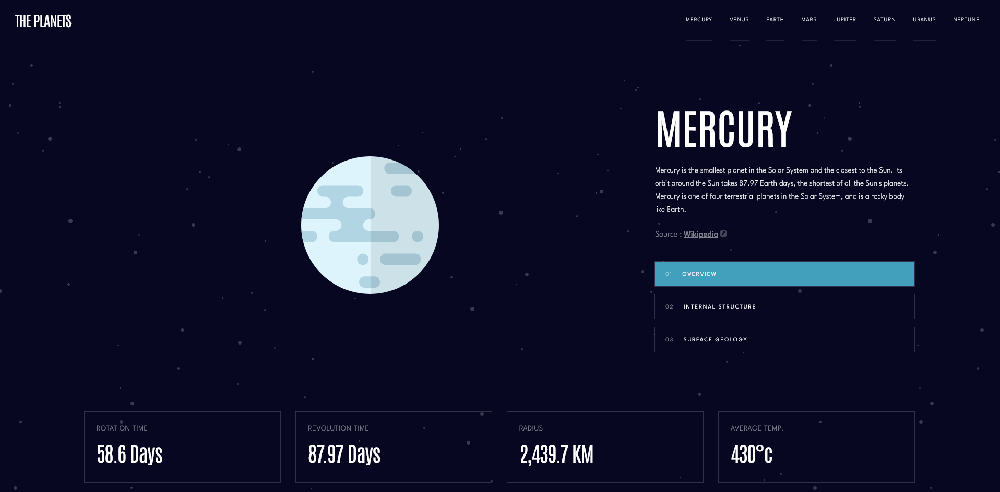
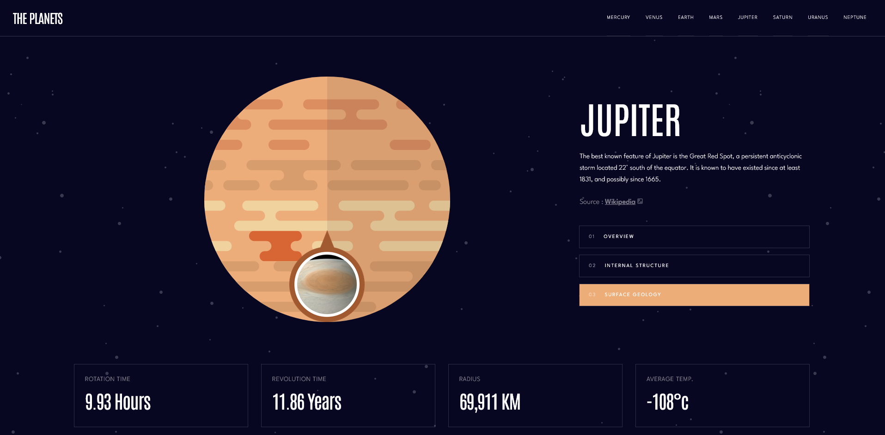
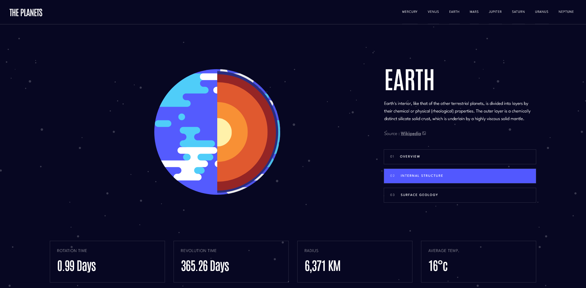

# Frontend Mentor - Planets fact site solution

This is a solution to the [Planets fact site challenge on Frontend Mentor](https://www.frontendmentor.io/challenges/planets-fact-site-gazqN8w_f).

## Table of contents

- [Overview](#overview)
  - [The challenge](#the-challenge)
  - [Screenshot](#screenshot)
  - [Links](#links)
- [My process](#my-process)
  - [Built with](#built-with)
  - [What I learned](#what-i-learned)
  - [Continued development](#continued-development)
- [Author](#author)

## Overview

### The challenge

Users should be able to:

- View the optimal layout for the app depending on their device's screen size
- See hover states for all interactive elements on the page
- View each planet page and toggle between "Overview", "Internal Structure", and "Surface Geology"

### Screenshot

### Links

- Solution URL: [Solution](https://www.frontendmentor.io/solutions/planets-fact-site-vanilla-js-css-html-9zfyPvVCs7)
- Live Site URL: [Live Site](https://blessyoumate.github.io/planets-fact-fm/)

## My process

### Built with

- Semantic HTML5 markup
- CSS custom properties
- Flexbox
- CSS Grid
- Mobile-first workflow

### What I learned

I improved my JavaScript structure and learnt some new tricks

### Continued development

I plan to use React for my next project and manage my time better, even during busy periods.

## Author

- Frontend Mentor - [@BlessYouMate](https://www.frontendmentor.io/profile/BlessYouMate)